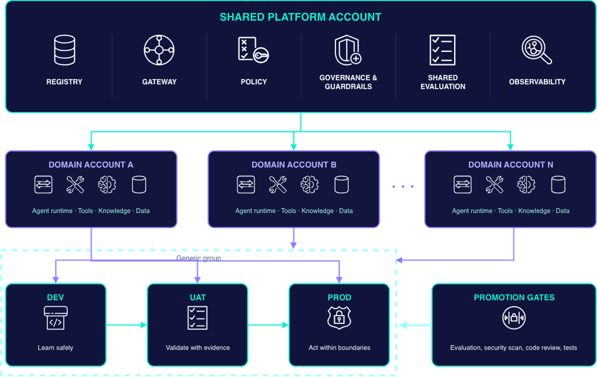
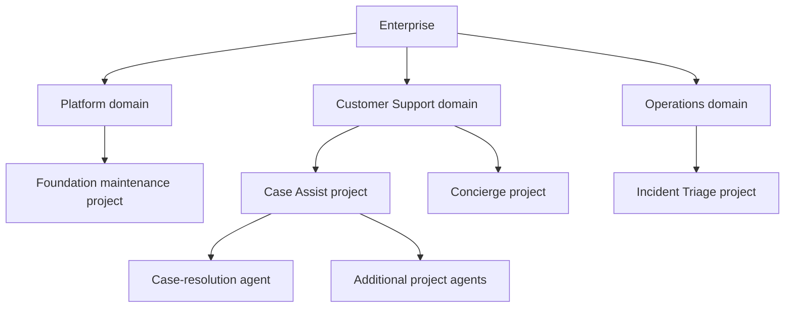

# Enterprise Agentic AI Platform

**Build, govern and operate agents at scale.**

When every business team builds agents independently, each team also builds its
own model access, tool connectors, identity, evaluation and deployment machinery.
Pilots can succeed while the enterprise accumulates duplicated engineering,
inconsistent controls and agents with no clear production owner. The challenge
at scale is making delivery repeatable, governed and observable across domains.

This repository demonstrates a **self-service operating model** for
addressing that challenge: a shared enterprise control plane supplies approved
blueprints and a mandatory engineering foundation, while domain teams build and
operate agents for their business use cases. The console connects that shared
foundation to a GitHub-based development and delivery journey.

[Architecture](#organization-architecture-the-hybrid-operating-model) ·
[Governance](#governance-framework) ·
[Builder journey](#builder-journey-from-workspace-to-production) ·
[Maturity model](#platform-maturity-four-stages) ·
[Deploy](#deploy-to-a-clean-aws-account)

## The problem: agents built in silos

Different frameworks are useful; rebuilding enterprise controls for every agent
creates avoidable risk and work. Without a shared platform, six gaps recur:

| Scaling problem | What the enterprise needs |
| --- | --- |
| Agent sprawl and duplicated engineering | Discoverable, versioned blueprints, skills and tools that teams can reuse. |
| Shadow AI and inconsistent security | Approved identity, resource access, runtime boundaries and enforceable policy. |
| Cost blindness | Usage and cost attribution by domain, project and agent, with accountable owners. |
| Observability gaps | Correlated runtime, model and agent signals that support failure diagnosis and business measurement. |
| Integration chaos | Governed connections to models, enterprise data, APIs and tools through standard interfaces. |
| Ownership ambiguity | Explicit responsibility for shared infrastructure, agent behavior, business acceptance and production decisions. |

## The solution: shared controls, domain-owned agents

**Centralise what needs consistency; distribute what needs autonomy.** An agentic
AI platform provides reusable capabilities for model access, tools, data/context,
execution, security, evaluation, delivery and operations. Teams compose these
capabilities rather than implementing a separate operating stack for every agent.

The platform connects existing enterprise capabilities: cloud landing zones,
workforce identity, security and risk, data and AI/ML platforms, source control,
CI/CD, integration services and observability. Domain teams bring use cases,
subject-matter expertise and business acceptance. The platform makes their
responsibilities and controls work together throughout the agent lifecycle.

### Agent = Model + Harness

The model provides reasoning and generation. The **harness** provides the
engineering needed to turn those outputs into reliable actions: orchestration,
skills and tools, memory and context, an execution sandbox, evaluation and
observability. Governance and security apply across every layer.

| Foundation Harness — platform owned | Domain Harness — domain team owned |
| --- | --- |
| Identity, least-privilege access, policy and mandatory guardrails | Business instructions, persona, agent logic and orchestration |
| Approved model/tool access, Gateway integration and runtime foundations | Domain skills, tool integrations and permitted system actions |
| Standard telemetry, audit and usage/cost integration | Knowledge sources, retrieval and memory strategy within approved boundaries |
| Evaluation infrastructure, baseline checks and delivery gates | Representative datasets, task-quality metrics, thresholds and SME acceptance |

A blueprint packages a versioned starting point for both. The platform maintains
the common foundation; builders extend the business behavior. Lower scopes may
strengthen inherited controls, but cannot silently weaken them. Exporting a
blueprint produces development assets; deployment provisions or binds the runtime
resources required by that application.

## Organization architecture: the hybrid operating model



*Reference enterprise topology from the accompanying platform presentation.*

The **shared platform account** hosts the control plane: Registry, Gateway,
policy, governance and guardrails, shared evaluation and observability. These
services provide consistent resource discovery, access controls and evidence
across the enterprise.

**Domain accounts** host the application plane: agent runtimes, domain tools,
knowledge, memory and business data. Approved configuration and controls flow
down; permitted telemetry and release evidence flow back to the platform.
Central visibility does not require centralizing domain data or giving platform
operators unrestricted access to sensitive content.

Each domain's delivery path advances through **dev → UAT → prod**. Dev supports
safe development with test data and controlled integrations; UAT validates
production-like behavior with SME acceptance; prod operates with live integrations,
service objectives and enforced boundaries. Promotion combines evaluation,
security scans, code review and tests. Production additionally requires a human
decision tied to the release and target. This repository calls the UAT stage
**preprod** in its delivery contract.

The diagram is a reference topology, not an account-vending claim. This demo can
represent multiple logical domains in one AWS account. Separate domain accounts,
environment bindings and cross-account isolation require explicit provisioning
and verification; installing the console does not create the full topology.

### Why hybrid?

| Operating pattern | Responsibility split | When it fits |
| --- | --- | --- |
| Centralised | The platform team builds, deploys and operates agents; domains supply requirements and acceptance. | Teams need extensive platform support, with the platform team carrying delivery capacity. |
| Federated | Domains adopt shared foundations and own their delivery and operations. | Domain teams have the engineering and operational capability to run agents independently. |
| **Hybrid — this demo's architecture** | A central control plane governs all domains; capable teams operate their applications and others receive platform assistance. | Enterprises have teams with different levels of capability and need consistent controls across them. |

Shared infrastructure and availability issues belong to the platform operating
function. **Agent quality, accuracy and business outcomes remain the domain
team's responsibility**, including when the platform assists with deployment.

## Domains, projects and personas



A **domain** is a business unit and governance boundary. Each domain owns multiple
**projects**; each project is a persistent build workspace that can contain
multiple agents and repositories. Users can belong to multiple projects. Platform
also owns projects through this same model; its enterprise oversight is separate
from ownership of other domains' workspaces.

| Responsibility | Owner and scope |
| --- | --- |
| Shared foundation and governance | Platform Admin manages shared blueprints, Registry policy, domain bootstrap and authorized platform decisions. |
| Domain workspace management | Domain Lead manages the domain's projects, memberships and resource subsets within platform controls. |
| Agent development | Domain Builder composes, exports and develops agents inside assigned projects. |
| Agent consumption | End User uses agents they are authorized to access; consumption does not grant build access. |

**Persona determines permitted actions; membership determines scope.** Selecting
a persona or domain in the browser does not grant access. Domain and project
resource permissions further restrict the models, skills, tools and blueprints a
builder may select. Projects are created only through an explicit administrator
or lead workflow, not implicitly by generating an agent.

Logical domains do not automatically create AWS accounts. Account, region and
environment bindings are configured separately; a single-account demonstration
is not evidence of cross-account isolation.

## Governance framework

The governance model follows the agent from resource selection to production and
operation. Lower scopes may strengthen inherited controls, but cannot silently
weaken the platform baseline.

| Stage | Control and enforcement responsibility |
| --- | --- |
| Discover and compose | Registry tracks resource ownership, version and approval. APIs validate the intersection of domain entitlement and project resource policy. |
| Develop | The exported Foundation Harness carries baseline configuration and CI hooks. Builders extend business code and evaluation assets within those controls. |
| Verify | CI runs tests, evaluation and compliance checks. Missing business evaluation is incomplete evidence, not a passing result. |
| Promote | The production delivery path requires an authorized human decision bound to the release and target, then revalidates that decision before execution. |
| Operate | Runtime permissions and guardrails constrain use; telemetry, access decisions and audit records support investigation and subsequent improvements. |

Registry publication, resource-access requests, guardrail exceptions, runtime
tool-call approvals and production release approval are distinct decisions.
Approving a Registry record does not authorize a production deployment. A UI
status or an AI recommendation cannot replace the human production gate.
Platform oversight also does not automatically grant access to private prompts,
traces or memory contents.

This is the governing contract. The
[implementation and verification record](memory/projects/agentic-ai-platform-demo.md)
identifies which paths have been verified and which integrations remain incomplete.

### Evaluation and operations close the loop

In this responsibility model, the platform provides evaluation infrastructure,
trace capture, scoring
orchestration and a baseline metric library for safety, performance and
operations. The domain supplies representative datasets, task-completion and
accuracy measures, quality thresholds and SME review. Promotion should satisfy
both the platform baseline and the domain's business quality bar.

Observability and evaluation answer different questions: **is the system healthy,
and are its results good?** The reference model connects four layers:
infrastructure health; model latency, tokens and cost; agent completion and tool
success; and business outcomes such as customer satisfaction or time saved.
Those signals inform the next version of code, prompts, tools and evaluation
assets. A cost estimate or an Agent card alone does not prove business impact.

## Builder journey: from workspace to production

1. **Prepare the workspace.** A lead creates a project, assigns builders and
   selects resources within the domain's approved scope.
2. **Compose an agent.** The builder chooses a blueprint, foundation start or
   AI-assisted design, then supplies the agent name and Domain Harness settings.
3. **Review and export.** Inspect the actual code, instructions, configuration,
   evaluation assets and workflows. Export to an authorized GitHub repository,
   whose default name comes from the agent name. This handoff is an **undeployed
   construct**, not a running-agent test.
4. **Develop locally.** Clone the repository, follow its `AGENTS.md`, implement
   business behavior, and run local tests and supported AgentCore development
   workflows. Model calls still require the relevant AWS access.
5. **Push and verify.** A push or pull request triggers the exported GitHub
   Actions workflows. Configure the repository's identity, target bindings and
   evaluation prerequisites before expecting cloud-backed checks to succeed.
6. **Promote through environments.** Deploy the checked release to dev and
   preprod, collect evidence, and request platform human approval for production.
   Only the approved release and target may proceed through the production gate.
7. **Operate and improve.** Return deployment state and telemetry to the platform;
   use results to revise the agent and repeat the same delivery process.

Builders may provide a dataset, choose blueprint starter data, reference private
data or defer setup. Evaluation assets and configuration travel with the export;
custom evaluators and supported AgentCore evaluation integration are options.
Deferred evaluation permits development handoff but supplies no production
acceptance evidence. Inspect the repository preview and generated prerequisites
for the files and integrations included in the selected preset.

| Builder entry | Export preset | Starting point |
| --- | --- | --- |
| Start from Blueprint | FULL | Blueprint application code, specifications and shared evaluation/delivery assets. |
| AI-assisted design | SPEC | A design specification and development/test scaffold with shared controls. |
| Foundation start | MINIMAL | A foundation scaffold for implementing the application yourself. |

All three use the shared export composer and CI templates. Creating a GitHub
repository packages the workflows; their triggers run CI after the relevant
push/PR events. It does not itself certify an agent or deploy production.

## Platform maturity: four stages

The maturity model describes how an enterprise progresses from isolated agents
to repeatable delivery and then adaptive operations. Use it to identify the next
capability gap and a pilot that can prove the improvement.

| Stage | Operating state | Next step |
| --- | --- | --- |
| **1 — Ad Hoc Agents** | Isolated pilots, local prompts and custom code; inconsistent access controls and little tool or knowledge reuse. | Establish a shared platform mandate, ownership and minimum controls. |
| **2 — Platform Foundation** | Central model Gateway and routing, approved runtimes, basic governance/audit, and standard usage/cost attribution. | Make identity, guardrails, observability and cost management a reusable foundation. |
| **3 — Scale & Self-Service — this demo** | Approved architectural blueprints, a shared control plane, domain-owned agent delivery, automated evaluation and quality gates. | Scale reuse through project onboarding, Foundation/Domain Harness composition, CI/CD and evidence-based release approval. |
| **4 — Adaptive Platform** | An AI automation layer assists onboarding and scaffolding, tunes evaluation/tools and proposes operational improvements from feedback. | Improve the platform continuously while preserving governance, scope and human decision boundaries. |

**This repository demonstrates Stage 3.** Its central story is a domain builder
reusing an approved foundation, exporting agent-as-code to GitHub, developing
locally and delivering through governed environments. Stage 3 describes the
demo's operating model; it is not certification that every reference capability
has been provisioned or verified in every deployment.

**Stage 4 — Platform as Agent** is the next-stage vision: the platform becomes a
digital teammate that guides discovery, use-case fit, prerequisite checks,
capacity/cost planning, architecture, scaffolding, readiness and handoff. It then
uses operational and evaluation feedback to recommend improvements. AI-assisted
design in this console is an early touchpoint, not evidence of a completed
adaptive platform. Autonomous optimization and self-healing evaluation remain
future capabilities; an AI recommendation does not replace production approval.

## Implementation boundaries

The repository contains deployable hosted infrastructure, a local demo server,
export templates, tests and example agents. An installed console, a seeded Agent
card and a successfully deployed business agent are different states. Optional
Memory/KB resources, GitHub authorization, runtime bindings and evaluation setup
must be verified in the target account; they are not all created by console
installation. Local illustrative interactions are not cloud verification.

See [agent.md](agent.md) for the product contract,
[project memory](memory/projects/agentic-ai-platform-demo.md) for dated live evidence
and known gaps, and the deployment runbook below for installation. Coding agents
should start with [AGENTS.md](AGENTS.md).

Several console concepts were inspired by
[AWS Loom](https://github.com/awslabs/loom). This repository implements its own
control-plane and builder flows.

---

## Deploy to a clean AWS account

For an authorized reset of an existing installation, first follow the
[reinstallation procedure](docs/platform-reinstallation.md). Stack deletion
retains data and some fixed-name resources; it is not a complete reset by itself.

The portable AWS deployment includes both infrastructure packages:
`infra/platform-registry/` owns the Registry, AgentCore Gateways, inference
targets, and its runtime permissions boundary; `infra/serverless-platform/`
owns the hosted console and APIs. Do not deploy `PlatformWebStack` by itself in
a new account.

Use **Node.js 22** and the AWS CLI. Registry Lambda packaging also requires
**Python 3.10+ with pip**, or a running Docker daemon. Check the interpreter in
the same shell used for deployment: on macOS, Bash can resolve the system Python
3.9 even when an interactive shell uses a newer installation.

```bash
node --version
python3 -c 'import sys; assert sys.version_info >= (3, 10), "Python 3.10+ is required for local packaging"'
python3 -m pip --version
# If using Docker instead of local Python packaging:
# docker info
```

Follow the [pre-deployment security audit](infra/serverless-platform/README.md#mandatory-pre-deployment-security-audit)
and confirm CDK bootstrap before running:

```bash
export AWS_PROFILE="<configured-profile>"
export AWS_ACCOUNT_ID="<account-id>"
export AWS_REGION="us-west-2"
export GITHUB_REPOSITORY="aws-samples/sample-agentic-ai-platform-demo"
export COGNITO_DOMAIN_PREFIX="<globally-unique-prefix>"

npm ci
npm run infra:install
npm run serverless:install
npm --prefix infra/serverless-platform run security:audit
npm run platform:deploy:clean-account
```

Use your existing authenticated AWS environment instead of `AWS_PROFILE` when
running with workload credentials. Verify the caller account with STS. An
existing supported CDK bootstrap needs termination protection; if that is its
only missing prerequisite, enabling CloudFormation termination protection does
not require redeploying the shared bootstrap or replacing its execution policy.
Run the audit again after that change.

The command verifies the AWS caller, deploys
`AgenticPlatform-ControlPlane-Provisioned`, reads its generated Gateway outputs,
then deploys the web stack, `PlatformWebStack`, and finally deploys
`AgenticPlatform-DomainBootstrap` from the Web stack's outputs. All three
stacks are required: the domain-create wizard's `/api/domain-bootstrap*` routes
live in the DomainBootstrap stack, and a deployment without it shows bare
"Not Found" errors on every Domains page. Provision mode requires no
pre-existing Registry, Gateway, or permissions-boundary ARN. All taggable
resources use `auto-delete=no`.

---

## Required: initial administrator and demo access

Deployment does not create a permanent login user or default password. Follow
[Create the initial administrator](infra/serverless-platform/README.md#create-the-initial-administrator)
using the new stack's user pool and Console URL, then verify an actual login.
For the demo's top-right persona dropdown, explicitly authorize the designated
administrator as a `demo-operator` using the linked runbook and sign in again.
Ordinary administrator access alone does not enable persona switching.
Then run the documented `platform:initialize:demo-workspaces` plan/apply sequence
to enroll those operators in the seeded domain projects. Persona switching alone
does not grant Builder project access. Verify both domain workspaces before handover.

## Configure direct GitHub delivery

The default installation supports a builder's own classic GitHub token with
`repo` and `workflow` permissions. Review the repository preview, confirm its
name and private creation, then provide the token for that export. It is not
saved in the platform's stores or exported files; revoke it in GitHub when no
longer needed. AWS credentials alone do not authorize GitHub repository creation.

Browser OAuth is an optional alternative. Follow
[Builder GitHub setup](docs/github-builder-setup.md) for both paths and the OAuth
App callback/secret configuration. OAuth requires both
`JOURNEY_GITHUB_OAUTH_CLIENT_ID` and `JOURNEY_GITHUB_OAUTH_CLIENT_SECRET_ARN`;
after a new API callback is known, configure the dedicated app as documented.
Verify an actual repository delivery before claiming export works. Successful
console deployment or a ZIP download is not GitHub delivery evidence.

## Optional: Knowledge Bases

> **Creates AWS resources — this step is OPTIONAL.**
> The console and agents run without Knowledge Bases; you only need this if you
> want Bedrock RAG attached to the concierge and it-helpdesk agents.

The `infra/knowledge-bases/` CDK stack provisions per-project S3 buckets,
OpenSearch Serverless collections, and Bedrock Knowledge Bases.

**Cost note:** OpenSearch Serverless charges for OCUs even when idle.
Two collections cost roughly **$0.48 / hour (~$350 / month)** at minimum.
Tear down the stack when the demo is done.

```bash
cd infra/knowledge-bases
npm install
npx cdk deploy --context account=<account-id> --context region=us-west-2
```

After deploy, write the output IDs into the live-resources files and set
`KB_ID` on the agent runtime:

1. Copy `ConciergeKnowledgeBaseId` → `domain-examples/concierge/agentcore/live-resources.json`
2. Copy `ItHelpdeskKnowledgeBaseId` → `domain-examples/it-helpdesk/agentcore/live-resources.json`
3. Re-deploy the affected agent runtime so it picks up the `KB_ID` env var.

See [`infra/knowledge-bases/README.md`](infra/knowledge-bases/README.md) for
full instructions, prerequisites and teardown steps.

---

## What's in this repo

| Path | What it is |
| --- | --- |
| `console/` | The self-service console (L3). A single-page UI with local and hosted API implementations: browse approved resources, compose an agent, review evaluation assets and export a development repository; manage fleet and governance separately. |
| `blueprints/` | The **Foundation Harness** templates the platform publishes: `chatagent/` and `workflowagent/`. They supply code and integration points for inherited controls; target resources and deployment prerequisites must still be configured. |
| `platform-skills/` | The platform's **Agent Skills library**: versioned `SKILL.md` modules ([agentskills.io](https://agentskills.io) format) that agents load on demand via progressive disclosure. Composing an agent copies the selected skills into the project. |
| `domain-examples/` | Example agent implementations and generated local constructs. Deployment and memory readiness depend on the target environment; generated files are not proof of a live runtime. |
| `console/catalog.json` | Platform-curated config: approved models with pricing metadata, blueprints + options (5 frameworks × 4 hosting targets with a compatibility matrix), and GitHub export targets. Blueprints ALSO get versioned AI Registry entries (owned, semver + pin — agents pin the blueprint version they were composed from). |
| `console/registry-seed.json` | The committed seed for the unified **AI Registry** (skills, typed tools, MCP servers, A2A agents in the versioned entry shape). First server start copies it — plus catalog models/blueprint pointers — into `console/ai-registry.json` (runtime state, gitignored). Domain teams **compose from this**. |
| `console/projects.seed.json` | The committed first-run seed for `console/projects.json` (runtime state, gitignored). If `projects.json` is missing, the server initializes it from this fixture so fresh clones have the demo projects. |
| `console/public/guardrails-policy.json` | The authoritative org guardrail policy: default pack, domain strengthen-only additions, and the configurable runtime controls. Ships with the frontend on every deployment (the Governance › Guardrails tab renders it); the console server enforces from the same file. |
| `scripts/seed-scale.mjs` | Scale fixture: seeds 3 extra domains + 110 AI Registry agent entries (5 domains / 130+ entries total) to demo the platform at fleet scale — registry pagination + search, per-domain scoping, vended builder logins. Apply: `node scripts/seed-scale.mjs` · remove: `--restore`. Touches only console-local stores; never fabricates AWS runtimes, cost ledger rows or audit entries. |
| `console/export-composer.mjs` | One export composer, three presets (FULL / SPEC / MINIMAL) — the doors differ only in what's packaged; the CI gate files come from the same shared sections. |
| `console/ci-templates/` | The shared CI gate every exported repo carries: `eval.yml` (golden-dataset eval, threshold gate, PR scorecard), `tests.yml`, `compliance.yml` (guardrail conformance + gitleaks secret scan), plus the `gates/` runner scripts. |
| `scripts/journey-roundtrip.mjs` | The "CI really runs" acceptance harness: stages an export via the composer, pushes it to a real private GitHub repo, opens a deliberately-failing PR and a passing PR, polls Actions, and asserts the eval gate blocks one and passes the other. Evidence ledger: `docs/gates-setup.md`. |
| `e2e/` | Playwright browser probes, flow checks and persona journeys. `cd e2e && npm run e2e`. |
| `docs/` | Architecture, maturity roadmap, user journey pages, the **demo script** (`docs/demo-script.md`), current contracts and operating guidance. |

---

## Sign-in and persona access

The hosted console uses Cognito. Initial administrator creation, demo persona
switching and Builder project membership are separate setup steps described
above. The local server uses a demo identity directory for its mock SSO flow;
that is not the hosted authentication implementation.

---

## Run the local console

Prerequisites:

- Node.js 20+
- The AgentCore CLI on your PATH: `npm install -g @aws/agentcore`
- The AWS CLI, configured with credentials for **us-west-2** (account with Bedrock
  AgentCore access)
- For the real AWS Agent Registry backing (optional): the Registry feature moved
  to the standalone `agent-registry` namespace — SDK `@aws-sdk/client-agent-registry-control`
  (installed here), boto3 >= 1.43.71 for Python tooling. The old `bedrock-agentcore`
  registry namespace is discontinued **2026-09-17**. AWS CLI 2.36.17 does not
  include the `agent-registry-control` commands yet — upgrade the CLI or use
  boto3 for manual registry checks. Gateway/runtime/memory operations stay on
  `bedrock-agentcore` (unaffected by the split).
- Hosted GitHub delivery requires a caller-owned classic token with `repo` and
  `workflow` permissions, or the optional configured OAuth App. See
  [Builder GitHub setup](docs/github-builder-setup.md) for token handling and scope.

```bash
cp .env.example .env          # set AWS_PROFILE / AWS_DEFAULT_REGION
node console/server.mjs       # serves http://localhost:4000
```

Open http://localhost:4000, pick a persona, and walk the **Build an Agent** flow.

The agent lifecycle stepper (Exported → In development → Eval results available →
Deployed → Registered) renders **read-only** by default. The "advance" buttons on
the export tracker and the fleet agent detail stand in for real-world triggers this
demo has no wiring for — a commit landing, CI finishing, a deploy — so they stay
hidden unless you ask for them:

```bash
SHOW_SIM=1 node console/server.mjs   # reveals the lifecycle advance buttons
```

`POST /api/lifecycle-advance` is unaffected by the flag: the e2e suite drives
lifecycle stages through the API, but a stored lifecycle stage is not evidence that a deployment occurred.

**Validation never writes.** `POST /api/validate` and `POST /api/wizard-validate`
answer "would this work" and are side-effect-free: they touch no file, so
validating before a commit cannot dirty the working tree. Several console stores
(`ai-registry.json`, `domain-policies.json`, …) are otherwise seeded lazily on
first read, and validation used to materialize them as a side effect; the seed is
now used in memory and left unwritten, which changes nothing about the *answer* —
a domain-enforced guardrail is still enforced from the in-memory seed. Pass
`--write-env` to opt back in and let a validate persist those seeds:

```bash
node console/server.mjs --write-env   # or WRITE_ENV=1 — validation may seed its stores
```

Only lazy seed/backfill writes are affected. A real save — approving a registry
entry, creating a project — always writes, flag or no flag.
`e2e/smoke-validation-readonly-blueprint-policy.mjs` is the regression test.

**A blueprint reference is gated server-side.** The wizard only offers blueprints
you may build from, but a hidden option is not a control, so the server applies
the rule itself. A blueprint is usable iff it is **APPROVED in the AI Registry**
and visible to your domain (own-domain or `shared`), **or** a **peer-approved
contribution** in the blueprint-submissions queue — a contribution never enters
the registry, so approval there is the other real signature. Anything else —
`DRAFT`/`IN_REVIEW`/`REJECTED` in the registry, a submission still
`pending_approval` or `rejected`, another domain's blueprint, an id that exists
nowhere — is refused with a `400` naming the reason, on both entry points:
`POST /api/generate` (agent compose/import) and `POST /api/wizard-validate` /
`POST /api/wizard-create` (project create/bootstrap). The refusal lands before any
work, so nothing half-created is left behind. Same regression test.

### Real-mode startup (live demo)

```bash
source demo-env.sh            # OBS_BACKEND=cloudwatch, REGISTRY_BACKEND=aws, fixtures unset
node preflight.mjs            # must be green before demo — exits 1 on any failed check
node console/server.mjs
```

`preflight.mjs` asserts: caller account matches every config ARN, region consistency,
Langfuse + GitHub PAT SSM params readable, ≥1 AgentCore runtime, Cognito pool reachable.
It prints a check table plus the effective env switches; exit 0 only when all pass.

To verify the gate actually fails closed, break one precondition and expect exit 1:

```bash
AWS_REGION=us-east-1 node preflight.mjs   # FAILED assertion: region consistency, exit 1
```

Use `AWS_REGION` (not `AWS_DEFAULT_REGION`) for this check — `AWS_REGION` takes
precedence, so overriding only `AWS_DEFAULT_REGION` is masked when `AWS_REGION`
is already exported.

### Per-user identity (optional but recommended for the demo)

The identity flow signs demo users in to Cognito and forwards their profile to the
agent. Config lives in `.demo-secrets/cognito.env` (gitignored):

```
REGION=us-west-2
POOL_ID=us-west-2_XXXXXXXXX
CLIENT_ID=xxxxxxxxxxxxxxxxxxxxxxxxxx
```

The legacy local demo uses `alice` (Alice Chen) and `bob` (Bob Martinez).
Provision intended test identities explicitly; a new account does not inherit
these users.
With this in place, a deployed agent greets the signed-in user by name and keeps each
user's memory isolated. Without it, the console still runs; auth-protected agents just
can't be chatted with.

### Real GitHub delivery

In the hosted platform, a Domain Builder approves an immutable repository
preview and authorizes a private repository using a caller-owned token or the
optional browser OAuth flow. New exports write the reviewed files to `main`;
subsequent local development uses branches and PRs. The platform revokes tokens
issued through its OAuth flow after delivery; caller-owned tokens remain under
the user's control. See [Builder GitHub setup](docs/github-builder-setup.md).

### End-to-end tests

```bash
cd e2e
npm install && npx playwright install chromium   # first time only
npm run e2e
```

Runs the local browser suite against a locally started server. Check `e2e/run-all.mjs`
for the current suite and individual probe prerequisites. Screenshots land in
Git-ignored `artifacts/screenshots/`. Local results do not replace hosted-console
or GitHub-to-production verification.

---

## Giving the demo

`docs/demo-script.md` is the per-persona talk track: the maturity-journey framing,
what to click in what order for each persona, and what is real vs simulated at
each stop.

---

## What to verify in a deployment

Start with the [Console walkthrough and deployment checks](docs/console-navigation.md)
for screenshots, role-by-role navigation, expected initialization results and
troubleshooting. Use its handover checklist to distinguish a deployed stack from
a usable demo.

The Stage 3 demo spans several independently verifiable paths:

- Sign in as the intended persona and confirm domain/project membership scope.
- Select only approved project resources and generate an undeployed construct.
- Review and export actual files to GitHub, then develop and test locally.
- Check CI and evaluation evidence, environment bindings and human production approval.
- Inspect the deployed runtime and its actual telemetry, memory/knowledge bindings
  and usage signals rather than inferring readiness from seeded console records.

See [project memory](memory/projects/agentic-ai-platform-demo.md) for dated evidence
and remaining gaps. Complete multi-account isolation, organization-wide FinOps
and Stage 4 adaptive operation are not established by the console installation.

---

## Credits

- Console capabilities inspired by **[AWS Loom](https://github.com/awslabs/loom)**
  (awslabs), re-implemented in this repo's own style.
- Problem framing, Model + Harness, operating patterns and the four-stage maturity
  model follow *Enterprise Agentic AI Platform — Build, Govern, Operate Agents at
  Scale* (Dr. Melanie Li and Dr. Frank Huang) and the *AWS Cloud Day 2026* demo
  presentation. The organization architecture image was supplied by the owner.

---

## Security

See [CONTRIBUTING](CONTRIBUTING.md#security-issue-notifications) for security issue notifications. Please do not report security vulnerabilities in public GitHub issues.

## License

This library is licensed under the MIT-0 License. See the [LICENSE](LICENSE) file.
Third-party attributions are listed in [NOTICE](NOTICE).
