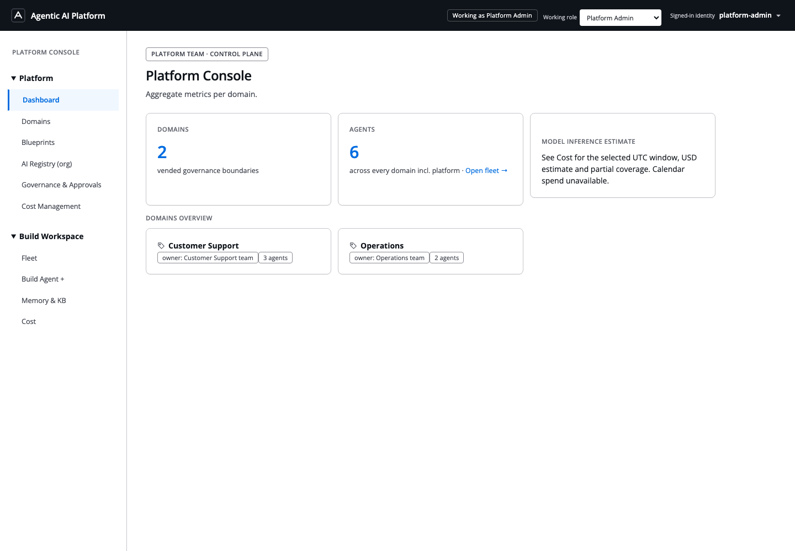
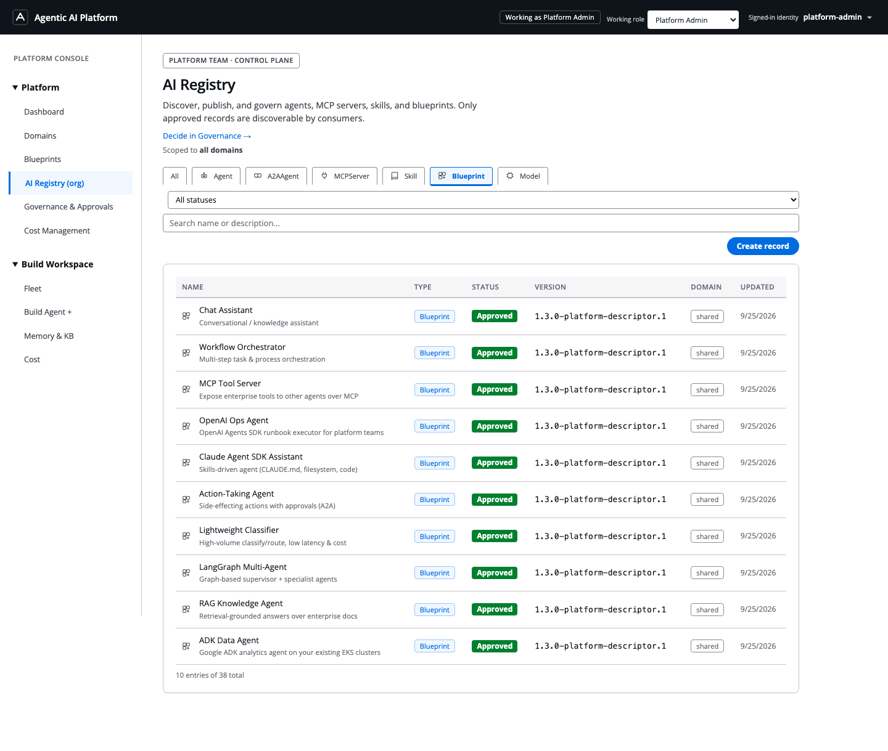
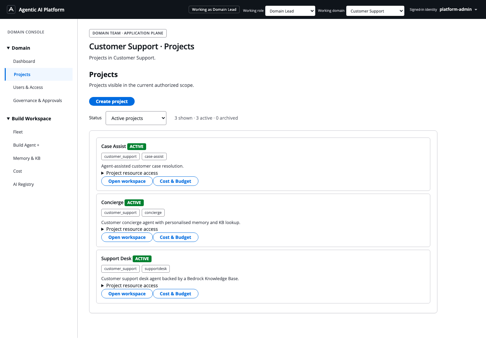
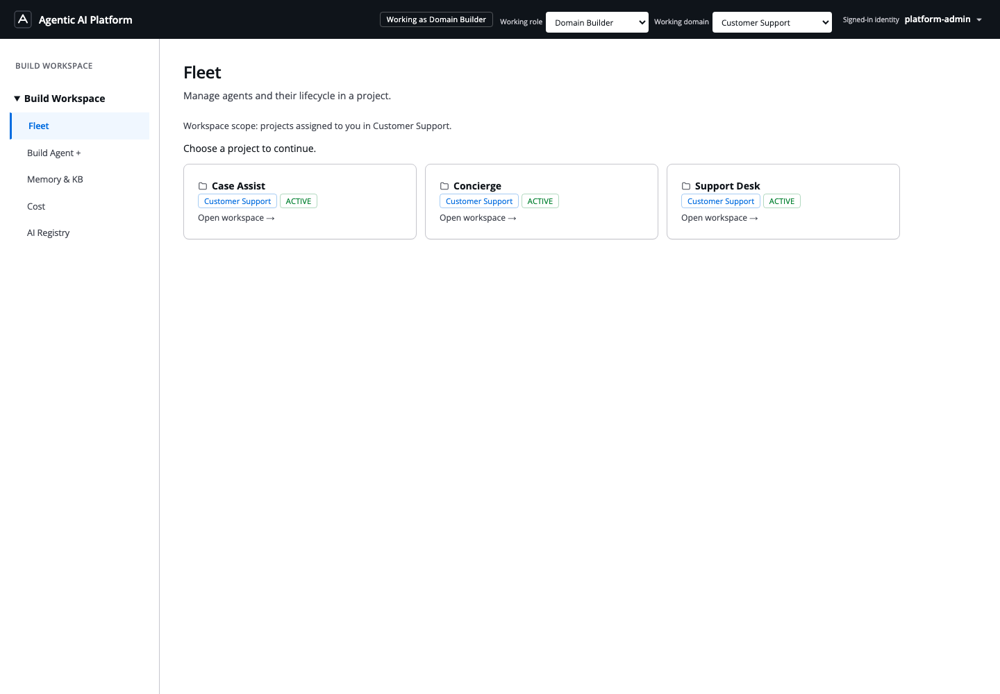
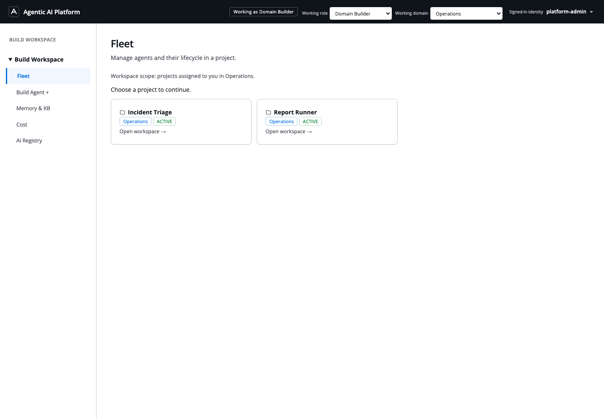
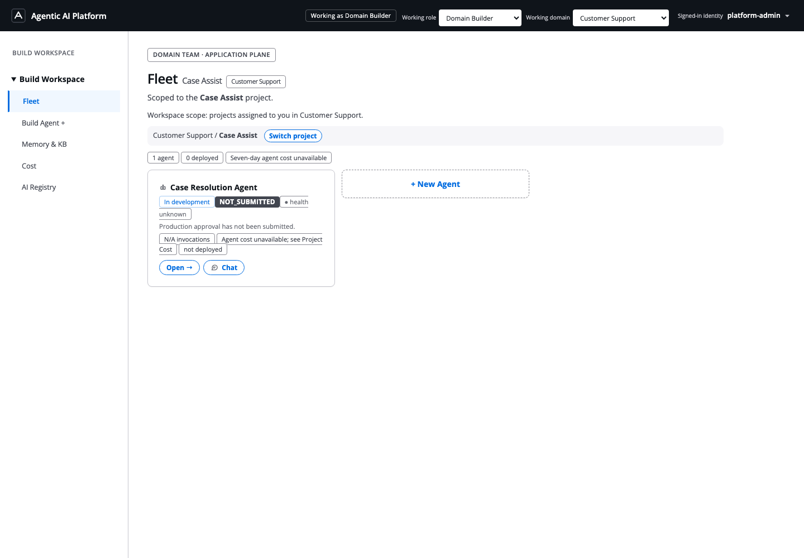
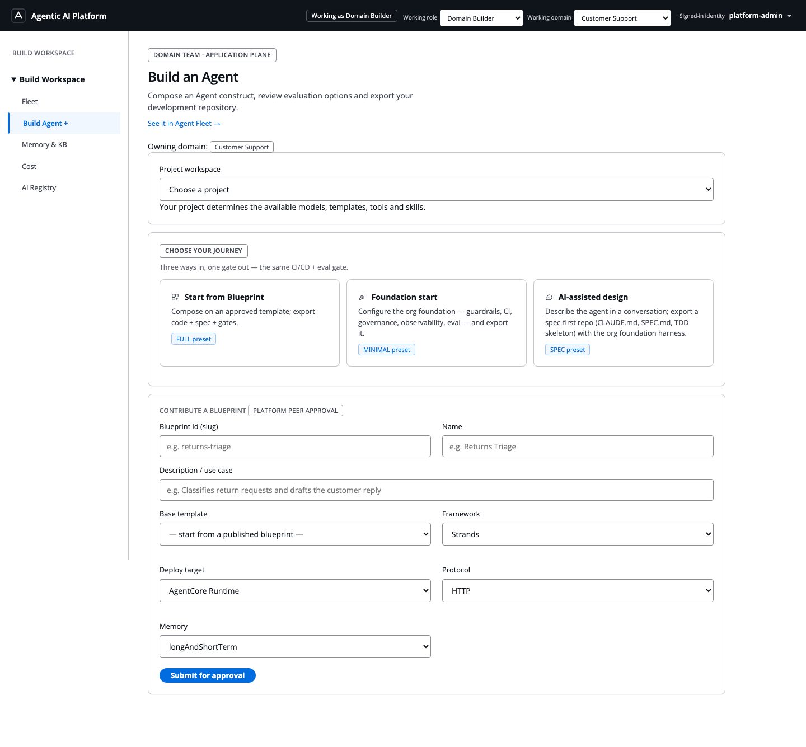
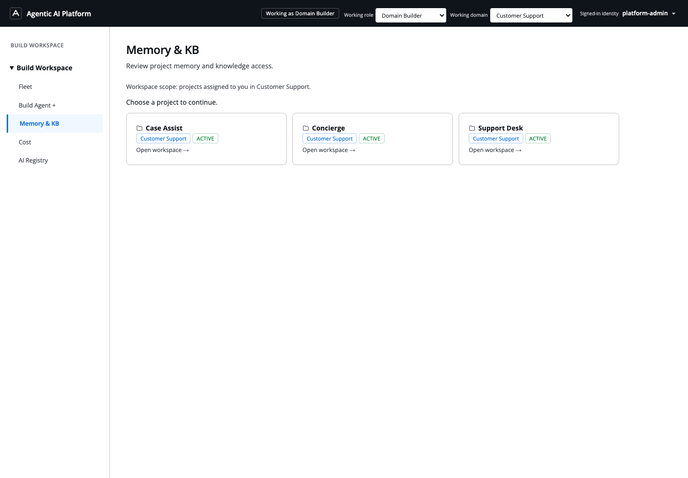
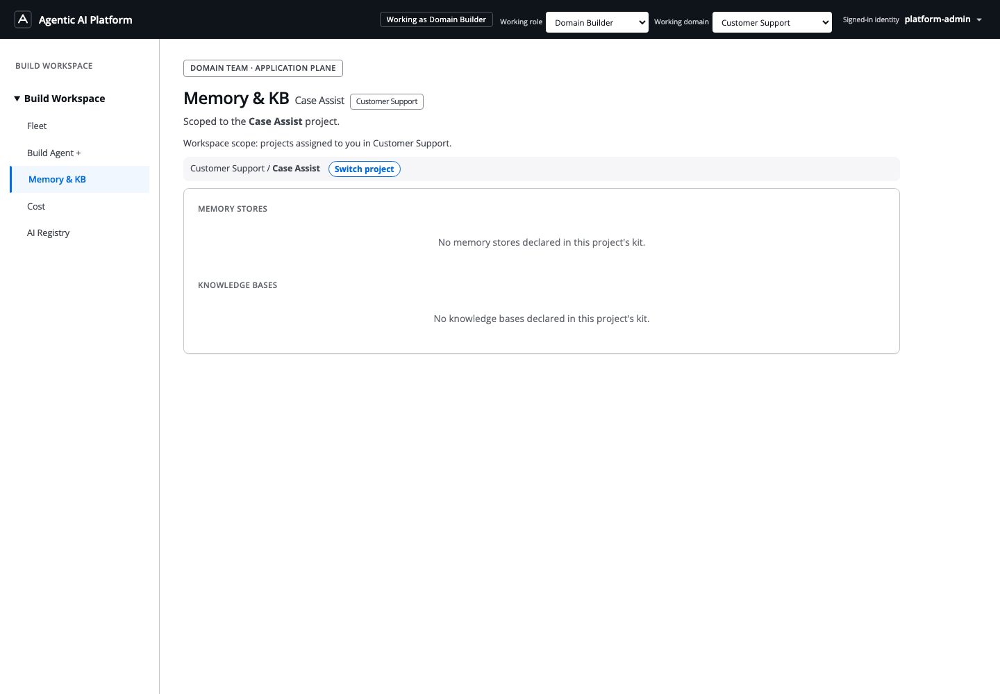

# Console walkthrough and deployment checks

Use this guide after deploying the platform to check that people can sign in,
find their workspaces and follow the Builder journey. A successful CloudFormation
stack is the start of acceptance, not proof that the demo is ready.

Reference screenshots were captured on 2026-09-26 from the hosted console
after explicit demo-operator onboarding.
They are reference views, not evidence that your account has the same resources,
permissions or deployed agent runtimes. Names and counts can change after you
create or archive projects. No default password is shipped with this repository.

Quick links: [Sign-in and setup](#1-open-the-correct-installation) ·
[Roles](#2-understand-roles-and-scope) · [Registry](#3-inspect-the-ai-registry) ·
[Projects](#4-check-projects-as-a-domain-lead) ·
[Builder](#6-follow-build-agent-to-repository-handoff) ·
[Troubleshooting](#troubleshooting) · [Handover checklist](#handover-checklist)

## 1. Open the correct installation

Use **ApplicationUrl** from the live `AgenticPlatform-Web` stack in your target
account and region. Use **UserPoolId** from the same stack when creating users.
An administrator in another installation's Cognito pool cannot sign in here.

Follow the deployment runbook in this order:

1. [Create the initial administrator](../infra/serverless-platform/README.md#create-the-initial-administrator).
2. Sign in and finish the temporary-password change.
3. For a demo operator only, [reconcile demo authorization](../infra/serverless-platform/README.md#reconcile-a-demo-operator-portably).
4. [Initialize demo workspace memberships](../infra/serverless-platform/README.md#initialize-demo-workspaces).
5. Sign out and sign in again to obtain fresh authorization claims.

The reconciliation command needs `COGNITO_DEMO_OPERATOR_GROUP=demo-operator`,
the deployed pool ID and state table name. Supply the **complete intended list**
of operators: reconciliation removes unlisted demo operators. Do not add multiple
persona groups to a user to manufacture a role picker.

**Pass:** the intended administrator can sign in with their own password, sees
Platform Admin, and can navigate without a sign-in failure. An authorized demo
operator also sees **Working role** in the header.

## 2. Understand roles and scope

Use **Working role** to select a demo persona. The product calls the domain
administrator **Domain Lead**. For Domain Lead and Domain Builder, use
**Working domain** to select an authorized business domain.

| Role | Start here | What to check |
| --- | --- | --- |
| Platform Admin | Platform → Dashboard, Domains, AI Registry (org), Governance & Approvals | Shared resources and organization-level governance; Platform owns its own build projects. |
| Domain Lead | Domain → Projects, Users & Access | Projects and memberships in the selected domain; explicit project creation. |
| Domain Builder | Build Workspace → Fleet, Build Agent + | Only authorized projects in the selected domain, with project-approved build resources. |
| End User | The destinations provided for this persona | Consumer access granted to that user; no administrative or Builder rights inferred from the demo role picker. |

A normal administrator need not have a role picker. It is available to explicitly
authorized demo operators, not every administrator. Ordinary users keep their
assigned persona and membership scope. Switching the UI does not grant project
membership or bypass API authorization.

## 3. Inspect the AI Registry

Open **Platform → AI Registry (org)** as Platform Admin, or **AI Registry** from
an authorized domain workspace.

Select **Agent**, **A2AAgent**, **MCPServer**, **Skill**, **Blueprint** or **Model**.
The selected filter must be visibly highlighted and the table's **Type** column
must match it. **All** can contain mixed types. Status and search filters further
restrict results; clear them before concluding that resources are missing.

Open a record to inspect its details and approval state. Registry visibility and
project resource eligibility are different: a resource visible to the platform
administrator is not automatically selectable by every project.

**Pass:** filter selection, visible highlighting and loaded results agree.
An empty result for a type with no records is valid. A Model tab displaying
Blueprint rows after loading has settled is a defect, not expected behavior.

## 4. Check projects as a Domain Lead

Select **Domain Lead → Customer Support → Projects**.

For the baseline demo, expect the following active project workspaces after
initialization:

| Domain | Starter projects |
| --- | --- |
| Customer Support | Case Assist, Concierge, Support Desk (`supportdesk`) |
| Operations | Incident Triage, Report Runner |

Use the project's **Open workspace** action to enter it. Inspect **Project
resource access** to understand available blueprints, models and other resources.
The status filter distinguishes active and archived projects; archived records
can remain for history without belonging in the active Builder selector.

To create another project, choose **Create project**, complete its steps and
review the final request before confirming. Opening the wizard or navigating
Build Agent must not silently create a project. Project resource selections must
respect the domain's approved catalog and inherited controls. A disabled control
should have an understandable reason; an entire unusable resource form warrants
investigation.

**Pass:** Customer Support lists its own projects; switching to Operations changes
that list. Platform-owned projects do not become Customer Support projects.

## 5. Enter a Builder workspace

Select **Domain Builder → Customer Support → Fleet**.

Choose an authorized project and inspect its agents. Then switch to **Operations**
and repeat the check.

Open **Case Assist** to see its project Fleet. **Switch project** returns to the
workspace choice. The reference below shows one agent in development and zero
deployed agents; a Chat button does not establish that an undeployed agent can run.

Demo role authorization and project membership are separate. After running the
workspace initializer, run its read-only plan again: `plannedGrants` should be
`0`. A non-member ordinary Builder must still be unable to access these projects.

**Pass:** both domains expose their initialized project workspaces. Agent records
are visible where assigned. A seeded agent record alone does not prove that its
runtime is deployed or callable.

## 6. Follow Build Agent to repository handoff

Open **Build Workspace → Build Agent +** and choose an existing project.

1. **Choose a journey.** Start from an approved blueprint, a foundation, or the
   AI-assisted design path supported by your installation.
2. **Compose from catalog.** Enter the agent name and instructions. Choose an
   eligible project model and configure the permitted skills, tools and other
   settings. The model selector must reflect project and domain access.
3. **Generate.** Generate the agent construct and proceed to review/handoff.
   This creates development assets; it does not prove a live runtime exists.
4. **Review evaluation and repository assets.** Inspect the actual files that
   will be exported: code, Foundation/Domain Harness configuration, coding-agent
   instructions, evaluation configuration/datasets and CI workflows. Supply
   your dataset or evaluator where supported, or retain the provided starter
   assets and customize them locally. Inspect what is included rather than
   treating a description of evaluation as evidence that an evaluation ran.
5. **Export to GitHub.** The suggested repository name should come from the
   agent's build name. Verify the destination and visibility, then export using
   the supported GitHub authorization. Open the resulting repository and check
   that its files actually exist.
6. **Develop locally.** Clone the repository, follow its `AGENTS.md` and README,
   edit the agent and run its documented local tests/evaluation. Push your changes
   to trigger its GitHub workflows.
7. **Verify delivery separately.** Inspect CI results, configure target environment
   bindings, and validate promotion through dev/preprod and production approval.
   The platform console installation does not establish a deployed agent pipeline.

See [GitHub Builder setup](github-builder-setup.md) for token/OAuth options. The
standard token path requires the documented GitHub permissions; an AWS login
alone does not authorize GitHub repository creation. A ZIP download is useful as
an alternative artifact, but does not pass the direct GitHub export check.

**Pass:** Generate advances, preview contains real files, and direct export creates
the expected repository. Record CI and runtime verification separately from
construct generation. The screenshots in this guide demonstrate navigation;
they do not attest that GitHub export or production delivery passed in your account.

## 7. Inspect governance, memory and cost honestly

**Governance & Approvals:** inspect the appropriate request category, its scope,
status and evidence. Empty queues can be correct in a fresh installation. To
verify production governance, use a real release request tied to its exact commit
and target, then confirm the delivery pipeline enforces the human decision.
A changed UI status alone does not establish production approval enforcement.

**Memory & KB:** open this page within the intended workspace.

After choosing **Case Assist**, the reference installation reports no declared
memory stores or knowledge bases:

Project/agent cards and real service bindings are separate. The initializer reports
`memoryBindings` and `knowledgeBaseBindings`; zero means resources have not been
bound. Provision/configure the actual services and ingest knowledge data before
expecting retrieval or memory behavior. Do not invent IDs to hide an empty state.

**Cost:** Platform Admin's account billing comes from Cost Explorer using the
installation's AWS credentials. The current query groups account costs by service
without a project-tag filter; other applications' service usage can therefore be
included. Domain/project/agent model costs are invocation-based estimates, not the
same measurement. Cost Explorer data can lag, and fresh installations may have no
usage. Neither zero cost nor a seeded agent card proves a successful invocation.

## Troubleshooting

| Symptom | Check and next action |
| --- | --- |
| No Working role dropdown | Confirm this is the intended installation and user. Complete demo-operator reconciliation successfully, including `COGNITO_DEMO_OPERATOR_GROUP=demo-operator`. Sign out/in for fresh claims. Do not grant every user demo access. |
| Dropdown exists but Builder Fleet is empty | Check the selected domain and project memberships. Run the documented initializer plan/apply/plan for authorized demo operators. Ordinary Builders need explicit project membership from their Domain Lead. |
| Sign-in fails or only works after a second attempt | Check the current stack URL/pool, confirmed/enabled user, password-change completion and exactly one persona group. Retry from the application URL in a fresh browser session. If reproducible, capture the error and request time; inspect callback configuration and service logs. Do not regard a successful retry as a permanent fix. |
| Too many projects | Check domain and status filter. Archived records are distinct from active workspaces. Inspect ownership and membership before removing data; do not delete projects merely to match this guide's screenshots. |
| Model list is empty or too broad | Check Registry approval, domain resource access, project policy and the selected workspace. Do not replace a scoped list with every provider model. |
| Project resource checkboxes cannot be selected | Check role, inherited policy and whether eligible resources loaded. If all appear disabled without a policy explanation, inspect API errors and the deployed frontend version. |
| Registry highlight does not match rows | Wait for the request to settle; clear other filters and reproduce. Record selected type, returned row types and failed requests. Verify the deployed frontend version and cache; report a persistent mismatch as a defect. |
| Generate reports invalid request/resource state | Check project is active, blueprint and model remain eligible, and required build fields are set. Inspect the failing response and request ID plus backend logs. Do not repeatedly create new projects as a workaround. |
| Direct GitHub export is unavailable or fails | Check the supported token/OAuth path, destination permissions, required token scopes and repository-name conflicts. An unconfigured OAuth application does not itself rule out the documented token path. Never attach tokens to support reports. |
| Memory/KB is empty | Check real resource bindings and ingestion. Workspace initialization grants access; it does not provision or populate those services. |
| Approval says `DECISION_ALREADY_RECORDED` | Refresh the release and inspect the recorded decision and delivery status. Do not resubmit or fabricate another approval. A recorded decision with a stuck pipeline needs delivery investigation. |
| Cost differs from this demo's expected spend | Compare account-wide service billing with invocation estimates and their time windows. Current account costs are not isolated by demo resource tags. |

When reporting a problem, include the deployment commit, region, page, working
role/domain/project, expected result, actual error, UTC time and request ID where
available. Redact passwords, tokens, cookies, authorization headers, private user
content and account-specific details from screenshots or network captures.

## Handover checklist

- [ ] Correct target account and live stack outputs verified.
- [ ] Permanent administrator created; first sign-in and password change tested.
- [ ] Authorized demo operator can switch roles after a fresh sign-in.
- [ ] Both domain workspaces initialized; repeated plan reports no missing grants.
- [ ] Ordinary non-member access remains denied.
- [ ] Registry filter highlight and result types agree.
- [ ] Domain/project ownership and active/archived filtering are correct.
- [ ] Builder can choose an eligible model and advance through Generate.
- [ ] Repository preview reviewed and direct GitHub export verified.
- [ ] Exported repository's local development and CI checked separately.
- [ ] Real runtime, evaluation, production approval and service bindings verified
      where required; unconfigured capabilities recorded explicitly.

For deployment commands, use the [serverless runbook](../infra/serverless-platform/README.md).
For a presentation talk track, use the [demo script](demo-script.md).
Keep dated verification evidence in [project memory](../memory/projects/agentic-ai-platform-demo.md).
